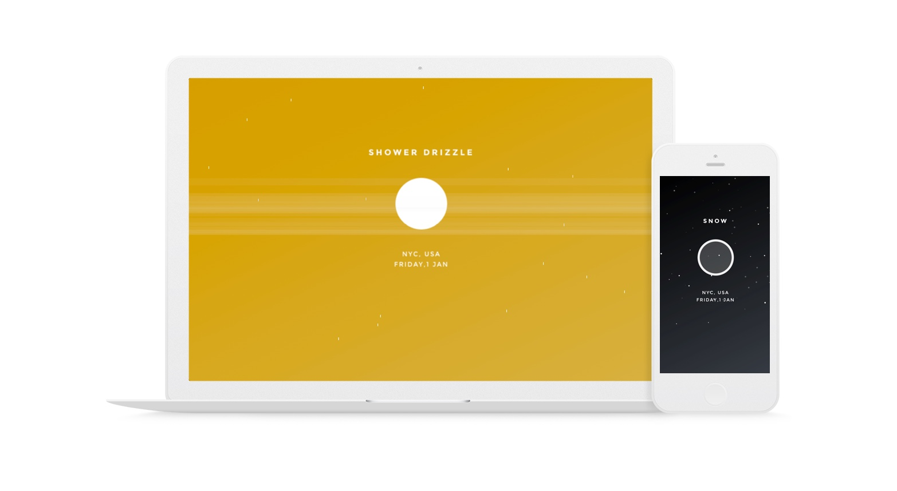

</img>
# Data visualization Weather App
Data visualization weather app.  
*Version 2.0 - 5 feb, 2016
</img>

Take a look at [http://carlosmarch.es/time](http://carlosmarch.es/time)!

## Description

This weather app uses openweather API and geolocation via HTML API. Then it displays a visualization of the weather results.

</img>
</img>
</img>
</img>
</img>